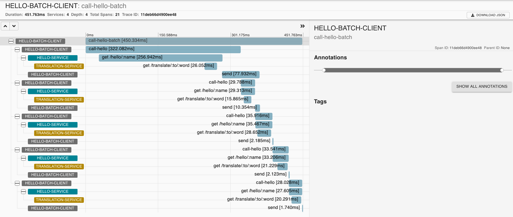
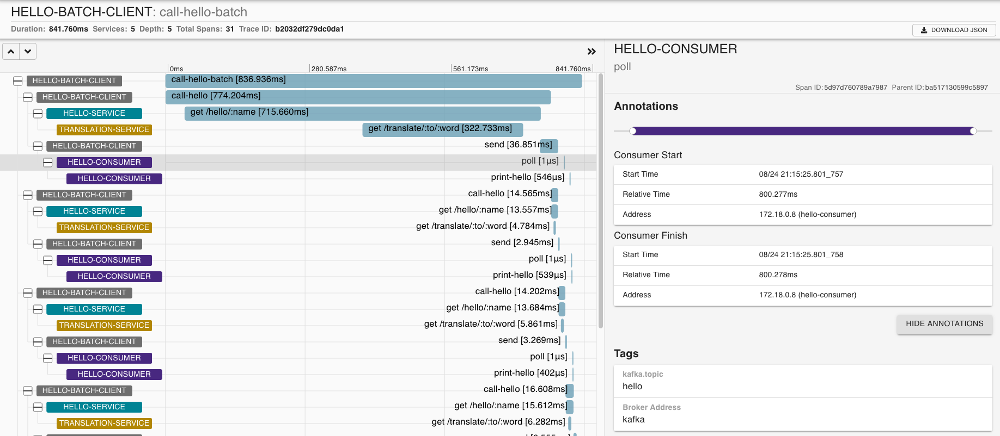

# Tracing Kafka-based applications with Zipkin

> Slides: <https://speakerdeck.com/jeqo/the-importance-of-observability-for-kafka-based-applications-with-zipkin>

## Labs

1. "Hello, world" distributed tracing: Understanding basics about distributed tracing.
2. Tracing Kafka-based applications: Instrumenting Kafka-based applications with Zipkin.
3. `Spigo` demo: How to experiment with Zipkin and models built on top of Tracing data.

### Pre-requisites

- jdk-8+
- docker tools (docker-engine, docker-compose)
- Confluent CLI (at least KSQL CLI)

Build applications and starts Docker compose environment: 

```bash
make
make start
```

## Lab 1: "Hello, world" distributed tracing

This lab introduce initial concepts about distributed tracing like `span`, `trace` and `context-propagation`.

### Scenario 1: "Hello, World" services (synchronous. RPC calls)

There is a service called Hello World that is capable of say hi in different languages, by using a Hello 
Translation service, and return a response to a user.

```
+--------+   +---------------+   +--------------------+
| Client |-->| Hello Service |-->| Transation Service |
+--------+   +---------------+   +--------------------+
```

A client (http) calls the `Hello` service expecting a greeting response. 
By tracing service operations, once a request is received and processed, spans are created. 
`hello` service depends on a `translation` service, to translate responses.

As the `translation` service has tracing enabled to record the execution of its operations, 
then the execution of translation operation will create more `spans`.

A `trace` is an aggregation of multiple spans that share a common `id`.

For instance, the `hello` service might trace the operation to receive a request and return a 
response, and also trace the `translation` service client calls: since it calls it until a response
is received, as a `child` span. 
For this 2 `spans` to be related, both need some shared reference (e.g. `trace-id`).

For translation service spans to be aware that they are part of a broader trace, they should 
as well receive some reference from a parent trace. 
As the HTTP Client call from `hello` service is instrumented with tracing, it will "inject"
the tracing context (e.g., `trace-id` and additional metadata) on the HTTP Headers.
The `translation` service, by receiving the trace context as part of the headers, will create 
its spans with reference to that context, with the same trace id.

Tracing libraries are in charge of propagating the context between calls (e.g., when `hello` service
creates a parent and child `spans`), and propagate context between service calls 
(e.g, HTTP client/server, Kafka publisher/subscriber).

These libraries record and report `spans` for the tracing infrastructure---Zipkin in this case--- 
collect and aggregate spans to be stored for further processing.

#### How to run it

1. Start `hello-service` in one terminal:

```bash
make hello-server
```

The `hello` service by itself is not enough to produce a successful response 
---it requires the `translation` service. To know that is working successfully: 
(1) you have to participate in a transaction
(e.g. make a request), (2) be watching the logs, or (3) produce some evidence from instrumentation. 

By enabling tracing on your services, every execution will collect evidence on the scope of a 
transaction: since a request is received and how it propagates.

2. Make a call (that will produce an error as `translation` service is down):

```bash
$ make test-hello
```

or 

```bash
$ curl http://localhost:18000/hello/service
{"code":500,"message":"There was an error processing your request. It has been logged (ID f0cbd609d1b40741)."}
```

3. And go to Zipkin to check the traces <http://localhost:9411/>:

> new Zipkin UI released recently, called Zipkin Lens, has been used.

Zipkin UI has 3 main pages: Search, Trace view, and Dependencies. We will explore each of them along 
these demos.

By searching all traces, one should be found that is the one created by our `curl` call:


As `translation` service is down, trace is mark as `error`. We can also observe that 2 spans are
part of this trace; that the total execution took 240 ms. and that it has been identified by a 
generated trace id.

Let's take a look to the trace details. On Zipkin Lens, we can check the details on the results,
or by clicking `>>`:


At the top we have a timeline representation of the spans: this represents a parent 
(`hello-service` handler) and a child spans (`translation-client` call). The empty space
before and after the child `span` represents the execution latency that has not been recorded
but that its visible.

Then, we have a table with a span per row, including service name, operation name, and latency.

By clicking a span, details include: annotations and tags. In the case of the HTTP handler, 
we have the HTTP verb, status code, path, etc.

4. If we start the translation service, run in another terminal: 

```bash
make hello-translation
```

5. Now, try to call the `hello-service` via curl: 

```bash
$ curl localhost:18000/hello/service
{"hello":"Hello, service","lang":"en"}
```

A new trace is stored, but in this case it is successful and in the trace details, 
you will see 3 spans, 1 from `hello` service, 1
from `translation` service, and 1 combined between client/server call:


Client/Server and synchronous communication creates this parent-child trace representations, where empty
spaces between spans represent processing and network latency that has not been recorded.

Spans can be created by using Tracing libraries. Zipkin has a Java library called `brave`, here is
an example of how to create a span:

`TranslationResource.java`:

```java
  @GET
  @Path("{lang}")
  @Produces(MediaType.TEXT_PLAIN)
  public Response translateHello(@PathParam("lang") final String lang) {
    /* START CUSTOM INSTRUMENTATION */
    final ScopedSpan span = tracer.startScopedSpan("query-repository");
    span.annotate("started-query");
    span.tag("lang", Optional.ofNullable(lang).orElse(""));
    final String hello = repository.find(lang);
    span.annotate("finished-query");
    span.finish();
    /* END CUSTOM INSTRUMENTATION */
    
    return Response.ok(hello).build();
  }
```

But most spans are created by using *instrumented* libraries: instrumentation is wrapping libraries
APIs, so you don't have to.

The first 2 spans are created by the instrumentation for 
[Apache HTTP Client](https://github.com/openzipkin/brave/tree/master/instrumentation/httpclient) 
and [Jersey HTTP Server](https://github.com/openzipkin/brave/tree/master/instrumentation/jersey-server):

By using existing libraries instrumentation you will get most of the picture on how 
your service collaborate, but when you need to get details about an specific task part
of your code, then you can add "custom" `spans`, so your debugging is more specific.

Even though this is a too simple example, getting to know how a successful and failed executions look like increase confidence and reduce cognitive load.

### Scenario 2: "Hello, World" events (asynchronous, messaging)

To explore how messaging and asynchronous executions are represented, let's test this use-case: 

```
+--------+      +---------------+        +------------------+
|        |-(1)->| Hello Service |-(1.1)->| Hello Transation |
|        |      +---------------+        +------------------+
| Hello* |
| Client |      +--------+      +-----------------+
|        |-(2)->| Kafka* |-(3)->| Hello Consumer* |
+--------+      +--------+      +-----------------+
```

> (*) new components

A batch hello client has a list of names to call `hello` service and get a response. 
Responses are propagated as events, using a Kafka topic. A `hello consumer` subscribe and process
`hello` events.

#### How to run it

1. Start the `hello-client`:

```bash
make hello-client
```

This will run the batch process to call `hello-service` 6 times in sequence.



`hello-client` receives a response and `send` an event to Kafka. We can see for instance that the
initial (*cold*) send take longer (~350ms) than the followings (~5ms).

2. Now, let's start the consumer to see how its executions will become part of the trace:

```bash
make hello-consumer
```

And let's run client batch again:

```bash
make hello-client
```

This time, let's focus on the initial spans by selecting this period on the timeline.
We can see for instance that `hello-consumer` is polling and processing the event, taking a few
nano seconds, and metadata as Kafka topic name and broker are collected.



> Benefit: Now we have evidence about how much time is taking for data to get downstream. 
For instance, is the goal of adopting Kafka is to reduce latency on your data pipelines, here 
is the evidence of how much latency you are saving, or not.

In the case of Kafka Producers and Consumers, the instrumentation provided by Brave is 
injecting the trace context on the Kafka headers, so the consumers spans can reference to 
the parent span.

## Lab 02: Tracing Kafka-based application

Kafka platform provides different APIs to implement streaming applications. We have seen 
in the Lab 01 that `Brave` offers instrumentation for Kafka Client library. In this Lab, we 
will evaluate how to instrument the other APIs: Streams API, Connect API and additional components
like KSQL.

To do this, let's introduce a new use-case: 

> We have applications developed around Twitter posts. First, we need to pull tweets
from Twitter. Once we have tweets available in Kafka, we need to process them, to then 
be consumed by many applications. 

Let's use [Kafka Twitter Connector](https://github.com/jcustenborder/kafka-connect-twitter)
to pull tweets into Kafka. 
Then, a Kafka Streams application transforms tweets from JSON into Avro format.

On the consumer side, a [Kafka JDBC Connector](https://github.com/confluentinc/kafka-connect-jdbc)
will consumer and send records to PostgreSQL, along with other applications.

**Data pipeline view**:

```
+---------+   +-------------------+          +------------------+    +----------------+
| Twitter |-->| Twitter Connector |-(kafka)->| Stream Transform |-+->| JDBC Connector |
+---------+   +-------------------+          +------------------+ |  +----------------+
                                                               (kafka) //other consumers
                                                                  |  +--------------+
                                                                  +->| Consumer App |
                                                                     +--------------+
                                                                  |  +------+
                                                                  +->| KSQL |
                                                                     +------+
```

**Event collaboration**:

```
                  Kafka
               +----------+
+---------+    |          |    +------------------+
| Twitter |-1->|(raw-json)|-2->|                  |
+---------+    |          |    | Stream Transform |
               |( parsed )|<-3-|                  |
               |          |    +------------------+
               |          |
               |          |       +--------------+    +------------+
               |( parsed )|--4.1->| DB Connector |--->| Postgresql |
               |          |       +--------------+    +------------+
               |          |
               |          |       +--------------+    +---------+
               |( parsed )|--4.2->| Consumer App |--->| Console |
               |          |       +--------------+    +---------+
               |          |
               |          |       +------+
               |( parsed )|--4.3->| KSQL |
               |          |       +------+
               |          |
               +----------+
```

### Tracing Kafka Clients and Kafka Streams

For Kafka Clients and Kafka Streams, as you implement the code, there are existing 
libraries to instrument them:

- Kafka Clients (Producer/Consumer): <https://github.com/openzipkin/brave/tree/master/instrumentation/kafka-clients>
- Kafka Streams: <https://github.com/openzipkin/brave/tree/master/instrumentation/kafka-streams>

### Tracing packaged Kafka applications

For the case of Kafka Connectors and other packaged applications 
(e.g. [KSQL](https://www.confluent.io/product/ksql/), 
[REST Proxy](https://docs.confluent.io/current/kafka-rest/docs/index.html)) 
are already packaged. However, Kafka clients 
include an API to inject code before messages are sent to Kafka, and before a 
message is consumed by consumers, called [Kafka Interceptors](https://cwiki.apache.org/confluence/display/KAFKA/KIP-42%3A+Add+Producer+and+Consumer+Interceptors).

This interceptors create a space to introduce tracing code to mark when messages are sent and 
consumed.

At [Sysco AS](https://github.com/sysco-middleware) we have developed interceptors
for Zipkin: <https://github.com/sysco-middleware/kafka-interceptor-zipkin> 

These interceptors have to be added to applications classpath, where can be referenced via properties:

Producer:
```java
    producerConfig.put(ProducerConfig.INTERCEPTOR_CLASSES_CONFIG, Collections.singletonList(TracingProducerInterceptor.class));
```

Consumer:
```java
    consumerConfig.put(ConsumerConfig.INTERCEPTOR_CLASSES_CONFIG, Collections.singletonList(TracingConsumerInterceptor.class));
```

And Confluent Docker images:

Connectors:
```yaml
      CONNECT_PRODUCER_INTERCEPTOR_CLASSES: 'no.sysco.middleware.kafka.interceptor.zipkin.TracingProducerInterceptor'
      CONNECT_CONSUMER_INTERCEPTOR_CLASSES: 'no.sysco.middleware.kafka.interceptor.zipkin.TracingConsumerInterceptor'
```

KSQL:
```yaml
      KSQL_PRODUCER_INTERCEPTOR_CLASSES: "no.sysco.middleware.kafka.interceptor.zipkin.TracingProducerInterceptor"
      KSQL_CONSUMER_INTERCEPTOR_CLASSES: "no.sysco.middleware.kafka.interceptor.zipkin.TracingConsumerInterceptor"
```

### Tracing Kafka Source Connector

In order to test this demo, you need to configure a Twitter application first, following instructions
here: <https://apps.twitter.com>

1. Start demo components:

```bash
make start-twitter
```

This command starts Kafka Connectors, KSQL and a kafka-consumer.

2. Add your secrets and Twitter connector configuration here: 
`twitter-tweets-source-connector/twitter-source.json`

Similar to this:

```json
{
  "name": "twitter_source_json_v01",
  "config": {
    "connector.class": "com.github.jcustenborder.kafka.connect.twitter.TwitterSourceConnector",
    "twitter.oauth.consumerKey": "1Ig*******************",
    "twitter.oauth.consumerSecret": "ZplIMKiQm4pOhD7t7X6**************************",
    "twitter.oauth.accessToken": "135***********-*****************88",
    "twitter.oauth.accessTokenSecret": "uh4qHNm8**************************",
    "value.converter": "org.apache.kafka.connect.json.JsonConverter",
    "key.converter": "org.apache.kafka.connect.json.JsonConverter",
    "value.converter.schemas.enable": false,
    "key.converter.schemas.enable": false,
    "kafka.delete.topic": "twitter_deletes_json_01",
    "kafka.status.topic": "twitter_json_v1",
    "process.deletes": true,
    "filter.keywords": "java,big,data,kafka"
  }
}
```

and deploy the Twitter Source Connector:

```bash
make twitter-source
```

This will start receiving tweets, based on keywords added as part of the configuration.

Kafka Connector (``) has been configured to use Zipkin interceptors:

```yaml
  kafka-connect-twitter:
    #...
    environment:
      #...
      CONNECT_PRODUCER_ZIPKIN_SENDER_TYPE: "KAFKA"
      CONNECT_PRODUCER_ZIPKIN_LOCAL_SERVICE_NAME: "kafka-connect-twitter"
      CONNECT_PRODUCER_INTERCEPTOR_CLASSES: "no.sysco.middleware.kafka.interceptor.zipkin.TracingProducerInterceptor"
```

So, we can go to Zipkin and check how traces are created:


Each trace will represent each tweet that has been received by connector and sent to Kafka.

Even though span recorded by interceptor are not as rich as the ones created by `brave` instrumentation,
they put off-the-shelf components as Connectors and KSQL into the picture, and mark the point where
message are sent/consumed, enabling a more accurate latency analysis. 

Similarly, Kafka JDBC Connector has tracing enabled via interceptors:

```yaml
  kafka-connect-jdbc:
    # ..
    environment:
      # ...
      CONNECT_CONSUMER_ZIPKIN_SENDER_TYPE: "KAFKA"
      CONNECT_CONSUMER_ZIPKIN_LOCAL_SERVICE_NAME: "kafka-connect-jdbc"
      CONNECT_CONSUMER_INTERCEPTOR_CLASSES: "no.sysco.middleware.kafka.interceptor.zipkin.TracingConsumerInterceptor"
```

To deploy:

```bash
make twitter-jdbc
```

### Tracing Kafka Streams applications

[Kafka Streams instrumentation](https://github.com/openzipkin/brave/tree/master/instrumentation/kafka-streams)
allow tracing of input (messages consumed), processors, and output (messages produced).
Processors that are created by Kafka Streams tracing utility are traced.

In this example:

```java
		final StreamsBuilder builder = new StreamsBuilder();
		builder.stream(config.getString("topics.input-tweets-json"), Consumed.with(Serdes.String(), Serdes.String()))
				.transform(kafkaStreamsTracing.map("parse_json", this::parseJson))
				.filterNot((k, tweet) -> tweet.hashtags().isEmpty())
				.transformValues(kafkaStreamsTracing.mapValues("json_to_avro", this::parseTweet))
				.to(config.getString("topics.output-tweets-avro"));
```

`builder.stream` is creating the first span, then `kafkaStreamsTracing.map()` is creating the next one,
and so on, until `builder.to` creates the last span, that represents a message been produced into another
topic.

This is how it looks like:

Run:

```bash
make twitter-stream
```


We can appreciate clearly that there is no parent case as messaging means producers and consumers
don't interact directly but via a broker.

The empty space between a message producer and consumed represents the network latency plus the broker
latency. If broker, like Kafka, would be instrumented to report tracing data, we could see how much
from this overall latency is actually part of Kafka.

Another interesting fact about this trace is that it shows how acknowledge works: in this trace
the `send` span represents the latency from sending a record until it receives an ack from the 
server. But in the meantime, consumer might be already consuming those records.

The overall latency on this pipeline trace is ~4ms. 

### Tracing KSQL

Similar to Kafka Connectors, KSQL can also make use of tracing interceptors to record activity
inside a KSQL server.

Let's add interceptors to KSQL docker compose service:

```yaml
  ksql:
    # ...
    environment:
      # ...
      KSQL_CONSUMER_INTERCEPTOR_CLASSES: "no.sysco.middleware.kafka.interceptor.zipkin.TracingConsumerInterceptor"
      KSQL_ZIPKIN_SENDER_TYPE: "KAFKA"
      KSQL_ZIPKIN_LOCAL_SERVICE_NAME: "ksql"
      KSQL_ZIPKIN_BOOTSTRAP_SERVERS: kafka:9092
      KSQL_PRODUCER_INTERCEPTOR_CLASSES: "no.sysco.middleware.kafka.interceptor.zipkin.TracingProducerInterceptor"
```

Then create a KSQL Stream to see how we can observe messages from Twitter to KSQL with Zipkin.

```bash
ksql http://localhost:8088

ksql> CREATE STREAM tweets_avro WITH (KAFKA_TOPIC='twitter-avro', VALUE_FORMAT='AVRO');

ksql> SELECT * FROM tweets_avro;
```
Now we have all distributed components collaboration, part of a Kafka data pipeline, 
evidenced as part of a trace:


### Service Dependencies

After recording traces from distributed components, you are storing actual
behaviour from your systems. Now you have the opportunity of creating models on
top of tracing data. One example is the service dependency model that comes out
of the box from Zipkin:


## Lab 3: Spigo Simulation

This lab is prepared to give some hints on how to getting started with tracing by experimenting and simulating 
architecture models.

@adrianco has developed a tool call SPIGO that is able to model an architecture as a 
JSON file, where all components and dependencies are described. Then you can visualize
and run this model. Finally you can export the traces from the simulation to Zipkin and Vizceral.

### How to run it

3 submodules are cloned for this demo:

- spigo
- go-vizceral
- vizceral-example

1. Describing and visualizing architecture

Spigo defines an architecture in JSON format, so you can use it later for visualization
and simulation.

For instance a simple case is the LAMP (Linux, Apache, MySQL and PHP) architecture
(`spigo/json_arch/lamp_arch.json`):

```json
{
    "arch": "lamp",
    "description":"Simple LAMP stack",
    "version": "arch-0.0",
    "victim": "",
    "services": [
        { "name": "rds-mysql",     "package": "store",       "count": 2,  "regions": 1, "dependencies": [] },
        { "name": "memcache",      "package": "store",       "count": 1,  "regions": 1, "dependencies": [] },
        { "name": "webserver",     "package": "monolith",    "count": 18, "regions": 1, "dependencies": ["memcache", "rds-mysql"] },
        { "name": "webserver-elb", "package": "elb",         "count": 0,  "regions": 1, "dependencies": ["webserver"] },
        { "name": "www",           "package": "denominator", "count": 0,  "regions": 0, "dependencies": ["webserver-elb"] }
    ]
}
```

And a more complex architecture would be Netflix one:

```json
{
    "arch": "netflix",
    "description":"A simplified Netflix service. See http://netflix.github.io/ to decode the package names",
    "version": "arch-0.0",
    "victim": "homepage",
    "services": [
        { "name": "cassSubscriber",     "package": "priamCassandra", "count": 6, "regions": 1, "dependencies": ["cassSubscriber", "eureka"]},
        { "name": "evcacheSubscriber",  "package": "store",          "count": 3, "regions": 1, "dependencies": []},
        { "name": "subscriber",         "package": "staash",         "count": 3, "regions": 1, "dependencies": ["cassSubscriber","evcacheSubscriber"]},
        { "name": "cassPersonalization","package": "priamCassandra", "count": 6, "regions": 1, "dependencies": ["cassPersonalization", "eureka"]},
        { "name": "personalizationData","package": "staash",         "count": 3, "regions": 1, "dependencies": ["cassPersonalization"]},
        { "name": "cassHistory",        "package": "priamCassandra", "count": 6, "regions": 1, "dependencies": ["cassHistory", "eureka"]},
        { "name": "historyData",        "package": "staash",         "count": 3, "regions": 1, "dependencies": ["cassHistory"]},
        { "name": "contentMetadataS3",  "package": "store",          "count": 1, "regions": 1, "dependencies": []},
        { "name": "personalize",        "package": "karyon",         "count": 9, "regions": 1, "dependencies": ["contentMetadataS3", "subscriber", "historyData", "personalizationData"]},
        { "name": "login",              "package": "karyon",         "count": 6, "regions": 1, "dependencies": ["subscriber"]},
        { "name": "home",               "package": "karyon",         "count": 9, "regions": 1, "dependencies": ["contentMetadataS3", "subscriber", "personalize"]},
        { "name": "play",               "package": "karyon",         "count": 9, "regions": 1, "dependencies": ["contentMetadataS3", "historyData", "subscriber"]},
        { "name": "loginpage",          "package": "karyon",         "count": 6, "regions": 1, "dependencies": ["login"]},
        { "name": "homepage",           "package": "karyon",         "count": 9, "regions": 1, "dependencies": ["home"]},
        { "name": "playpage",           "package": "karyon",         "count": 9, "regions": 1, "dependencies": ["play"]},
        { "name": "wwwproxy",           "package": "zuul",           "count": 3, "regions": 1, "dependencies": ["loginpage", "homepage", "playpage"]},
        { "name": "apiproxy",           "package": "zuul",           "count": 3, "regions": 1, "dependencies": ["login", "home", "play"]},
        { "name": "www-elb",            "package": "elb",            "count": 0, "regions": 1, "dependencies": ["wwwproxy"]},
        { "name": "api-elb",            "package": "elb",            "count": 0, "regions": 1, "dependencies": ["apiproxy"]},
        { "name": "www",                "package": "denominator",    "count": 0, "regions": 0, "dependencies": ["www-elb"]},
        { "name": "api",                "package": "denominator",    "count": 0, "regions": 0, "dependencies": ["api-elb"]}
    ]
}
```

> Package terms (e.g. denominator, zuul, karyon) emulate Netflix component names.

To visualize the architecture, open a new terminal and run:

```
make spigo-ui
```

This will start a web application on <http://localhost:8000> where you can visualize
your architecture from above:


2. Simulate your architecture

Once your architecture is defined, you can execute a simulation of requests from  `denominator` component.
This simulation will run on your machine creating Goroutines and channels communication
between them to emulate comunication between distributed components.

Run Spigo to generate traces:

```
cd spigo/
spigo -c -d 5 -a netflix
```

3. Export traces to Zipkin:

This execution will record Zipkin traces on `json_metrics/netflix_flow.json` file.
To export it to Zipkin, run:

```
cd spigo/
misc/zipkin.sh netflix
```

Then you can go to visualize traces on [Zipkin](http://localhost:9411)


And check how the service dependency is represented:


You can follow the same example with the current or desired architecture of your
organization and start experimenting with Distributed Tracing platforms like Zipkin.

4. Generate Vizceral traffic monitoring from your architecture:

Vizceral is one more example of models that can be built on top of tracing data.
It will show how messages are coming from the internet, are spread between data-centers
and then you can drill down into the details of specific components.

Migrate your Spigo model to Vizceral JSON model:

```
cd go-vizceral/arch2vizceral
cp <arch json> arch_json/.
./arch2vizceral -arch netflix > netflix_vizceral.json
```

Update the hard-coded reference to JSON located on `src/components/trafficFlow.jsx#L151`:

```jsx
  beginSampleData () {
    this.traffic = { nodes: [], connections: [] };
    request.get('netflix_vizceral.json')
      .set('Accept', 'application/json')
      .end((err, res) => {
        if (res && res.status === 200) {
          this.traffic.clientUpdateTime = Date.now();
          this.updateData(res.body);
        }
      });
  }
```

Copy Vizceral JSON to Vizceral example project and run example:

```
make vizceral
```

Go to <http://localhost:8080>

Traffic from internet to datacenters:


If you check one of the data centers, you will see the traffic between
services:


