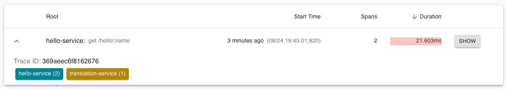
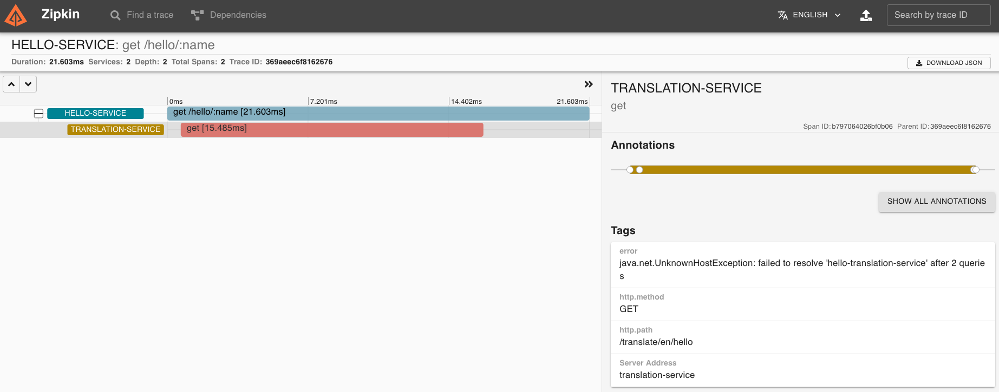

# Tracing Kafka-based applications with Zipkin

Slides: <https://speakerdeck.com/jeqo/the-importance-of-observability-for-kafka-based-applications-with-zipkin>

## Labs

1. "Hello, world" distributed tracing: Understanding basics about distributed tracing.
2. Tracing Kafka-based applications: Instrumenting Kafka-based applications with Zipkin.
3. `Spigo` demo: How to experiment with Zipkin and models built on top of Tracing data.

### Pre-requisites

- jdk-8+
- docker tools (docker-engine, docker-compose)

Build applications and starts Docker compose environment: 

```
make
make start
```

## Lab 1: Hello world distributed tracing

This lab introduce initial concepts about distributed tracing like `span`, `trace` and `context-propagation`.

### Scenario 1: Hello World Services

There is a service called Hello World that is capable of say hi in different languages, by using a Hello 
Translation service, and return a response to a user.

```
+--------+   +---------------+   +--------------------+
| Client |-->| Hello Service |-->| Transation Service |
+--------+   +---------------+   +--------------------+
```

A client (http) calls the `Hello` service expecting a greeting response. 
By tracing service operations, once a request is received and processed, spans are created. 
`hello` service depends on a `translation` service, to translate responses.

As the `translation` service has tracing enabled to record the execution of its operations, 
then the execution of translation operation will create more `spans`.

A `trace` is an aggregation of multiple spans that share a common `id`.

For instance, the `hello` service might trace the operation to receive a request and return a 
response, and also trace the `translation` service client calls: since it calls it until a response
is received, as a `child` span. 
For this 2 `spans` to be related, both need some shared reference (e.g. `trace-id`).

For translation service spans to be aware that they are part of a broader trace, they should 
as well receive some reference from a parent trace. 
As the HTTP Client call from `hello` service is instrumented with tracing, it will "inject"
the tracing context (e.g., `trace-id` and additional metadata) on the HTTP Headers.
The `translation` service, by receiving the trace context as part of the headers, will create 
its spans with reference to that context, with the same trace id.

Tracing libraries are in charge of propagating the context between calls (e.g., when `hello` service
creates a parent and child `spans`), and propagate context between service calls 
(e.g, HTTP client/server, Kafka publisher/subscriber).

These libraries record and report `spans` for the tracing infrastructure---Zipkin in this case--- 
collect and aggregate spans to be stored for further processing.

#### How to run it

1. Start `hello-service` in one terminal:

```
make hello-server
```

The `hello` service by itself is not enough to produce a successful response 
---it requires the `translation` service. To know that is working successfully: 
(1) you have to participate in a transaction
(e.g. make a request), (2) be watching the logs, or (3) produce some evidence from instrumentation. 

By enabling tracing on your services, every execution will collect evidence on the scope of a 
transaction: since a request is received and how it propagates.

2. Make a call (that will produce an error as `translation` service is down):

```
$ make test-hello
```

or 

```
$ curl http://localhost:18000/hello/service
{"code":500,"message":"There was an error processing your request. It has been logged (ID f0cbd609d1b40741)."}
```

3. And go to Zipkin to check the traces <http://localhost:9411/>:

> new Zipkin UI released recently, called Zipkin Lens, has been used.

Zipkin UI has 3 main pages: Search, Trace view, and Dependencies. We will explore each of them along 
these demos.

By searching all traces, one should be found that is the one created by our `curl` call:



As `translation` service is down, trace is mark as `error`. We can also observe that 2 spans are
part of this trace; that the total execution took 240 ms. and that it has been identified by a 
generated trace id.

Let's take a look to the trace details. On Zipkin Lens, we can check the details on the results,
or by clicking `>>`:



At the top we have a timeline representation of the spans: this represents a parent 
(`hello-service` handler) and a child spans (`translation-client` call). The empty space
before and after the child `span` represents the execution latency that has not been recorded
but that its visible.

Then, we have a table with a span per row, including service name, operation name, and latency.

By clicking a span, details include: annotations and tags. In the case of the HTTP handler, 
we have the HTTP verb, status code, path, etc.

4. If we start the translation service, run in another terminal: 

```
make hello-translation
```

5. Now, try to call the `hello-service` via curl: 

```
$ curl localhost:18000/hello/service
{"hello":"Hello, service","lang":"en"}
```

6. Check that a new trace is recorded, and it has 2 services collaborating: 


And in the trace details, you will see 3 spans, 1 from `hello-service` and 2
from `translation-service`:


and in Zipkin-Lense:


The first 2 spans are created by the instrumentation for 
[HTTP Client](https://github.com/openzipkin/brave/tree/master/instrumentation/httpclient) 
and [HTTP Server](https://github.com/openzipkin/brave/tree/master/instrumentation/jersey-server):

But the last one is created by using `brave` library (Zipkin instrumentation library for Java) directly on your code:

`TranslationResource.java`:

```java
  @GET
  @Path("{lang}")
  @Produces(MediaType.TEXT_PLAIN)
  public Response translateHello(@PathParam("lang") final String lang) {
    /* START CUSTOM INSTRUMENTATION */
    final ScopedSpan span = tracer.startScopedSpan("query-repository");
    span.annotate("started-query");
    span.tag("lang", Optional.ofNullable(lang).orElse(""));
    final String hello = repository.find(lang);
    span.annotate("finished-query");
    span.finish();
    /* END CUSTOM INSTRUMENTATION */
    return Response.ok(hello).build();
  }
```

By using existing libraries instrumentation you will get most of the picture on how 
your service collaborate, but when you need to get details about an specific task part
of your code, then you can add "custom" `spans`, so your debugging is more specific.

### Scenario 2: Hello World Events

Instead of a web client, a Client application with implement a batch process 
to call Hello Service and produce events into a Kafka Topic.


```
+--------+      +---------------+        +------------------+
|        |-(1)->| Hello Service |-(1.1)->| Hello Transation |
|        |      +---------------+        +------------------+
| Hello* |
| Client |      +--------+      +-----------------+
|        |-(2)->| Kafka* |-(3)->| Hello Consumer* |
+--------+      +--------+      +-----------------+
```

> (*) new components

This scenario represents how to propagate context when you are not communicating 
services directly by via messaging. In this case, we will use Kafka as an intermediate
component to publish events.

#### How to run it

1. Start the `hello-client`:

```
make hello-client
```

This will run the batch process to call `hello-service` 6 times in sequence.

It will take around 15 secs. to execute.

As this component is starting the trace, then `hello-service` and `hello-translation`
spans will become children of this parent span:


The messaging broker is defined as an external library here, as part of the `kafka-clients`
instrumentation, so we can have it as part of the picture.

> Interesting finding: first send operation by `kafka-client` Producer, is slower than the others.

2. Now, let's start the consumer to see how its executions will become part of the trace:

```
make hello-consumer
```


> Benefit: Now we have evidence about how much time is taking for data to get downstream. 
For instance, is the goal of adopting Kafka is to reduce latency on your data pipelines, here 
is the evidence of how much latency you are saving, or not.

In the case of Kafka Producers and Consumers, the instrumentation provided by Brave is 
injecting the trace context on the Kafka Headers, so the consumers spans can reference to 
the parent span.

## Lab 02: Twitter Kafka-based application

Kafka platform provides different APIs to implement streaming applications. We have seen 
in the Lab 01 that Brave offers instrumentation for Kafka Client library. In this Lab, we 
will evaluate how to instrument the other APIs: Streams API and Connect API.

To do this, we will introduce a use-case: 

> We have applications developed around Tweets. First of all, we need to pull tweets
from Twitter. Once we have Tweets available in our system, we need to parse them into 
our preferred format, to then be consumed by many applications. 

For this use-case we will use a [Twitter Source Connector](https://github.com/jcustenborder/kafka-connect-twitter)
to pull tweets into Kafka. We will implement a Kafka Streams application to transform from JSON to Avro format.
On the other side of Kafka, a [JDBC Source Connector](https://github.com/confluentinc/kafka-connect-jdbc)
will send records to PostgreSQL, and another consumer will print records to console.

**Data-flow view**:

```
+---------+   +-------------------+          +------------------+    +--------------+
| Twitter |-->| Twitter Connector |-(Kafka)->| Stream Transform |-+->| DB Connector |
+---------+   +-------------------+          +------------------+ |  +--------------+
                                                               (kafka)
                                                                  |  +--------------+
                                                                  +->| Consumer App |
                                                                     +--------------+
                                                                  |  +------+
                                                                  +->| KSQL |
                                                                     +------+
```

**Choreography view**:

```
                  Kafka
               +----------+
+---------+    |          |    +------------------+
| Twitter |--->|          |--->|                  |
+---------+    |          |    | Stream Transform |
               |          |<---|                  |
               |          |    +------------------+
               |          |
               |          |    +--------------+    +------------+
               |          |--->| DB Connector |--->| Postgresql |
               |          |    +--------------+    +------------+
               |          |
               |          |    +--------------+    +---------+
               |          |--->| Consumer App |--->| Console |
               |          |    +--------------+    +---------+
               |          |
               |          |    +------+
               |          |--->| KSQL |
               |          |    +------+
               |          |
               +----------+
```

### Instrumentation

For Kafka Clients and Kafka Streams, as you implement the code, there are existing 
libraries to instrument them:

- Kafka Clients (Producer/Consumer): <https://github.com/openzipkin/brave/tree/master/instrumentation/kafka-clients>
- Kafka Streams: <https://github.com/openzipkin/brave/tree/master/instrumentation/kafka-streams>

For the case of Kafka Connectors, implementation is already done, but Kafka offers 
an interface to inject some code before it produce records to Kafka, and before a 
record is consumed by consumers, called [Kafka Interceptors](https://cwiki.apache.org/confluence/display/KAFKA/KIP-42%3A+Add+Producer+and+Consumer+Interceptors).

At [Sysco](https://github.com/sysco-middleware) we have developed an initial version of interceptors
for Zipkin that reuse some of the logic of Kafka Instrumentation.

- Kafka Interceptors for Kafka Connect, REST Proxy, etc (alpha version): <https://github.com/sysco-middleware/kafka-interceptors/tree/master/zipkin> 

These interceptors have to be added to the classpath where connectors are running, and the pass them via configuration:

```yaml
      CONNECT_PRODUCER_INTERCEPTOR_CLASSES: 'no.sysco.middleware.kafka.interceptor.zipkin.TracingProducerInterceptor'
      CONNECT_CONSUMER_INTERCEPTOR_CLASSES: 'no.sysco.middleware.kafka.interceptor.zipkin.TracingConsumerInterceptor'
```

### How to run it

1. Configure a Twitter applications [here](https://apps.twitter.com) and set secrets here: `twitter-tweets-source-connector/twitter-source.json`

2. Deploy the Twitter Source Connector:

```
make start-twitter
# wait for connectors
make twitter-source
```

This will start pulling tweets, based on the configuration from `twitter-tweets-source-connector/twitter-source.json`.
You can go to Zipkin, as connector is instrumented, to validate that is running:


Each span will represent each tweet that has been received by connector and sent to Kafka.

It is just including the `on_send` method execution, that is not significant, but
it brings Kafka Connectors into the distributed trace picture.

2. Stream processor applications is instrumented to capture latency created by every task part of the stream-process:

```java

		final StreamsBuilder builder = new StreamsBuilder();
		builder.stream(config.getString("topics.input-tweets-json"), Consumed.with(Serdes.String(), Serdes.String()))
				.transform(kafkaStreamsTracing.map("parse_json",
						(String key, String value) -> {
							try {
								return KeyValue.pair(key, objectMapper.readTree(value));
							}
							catch (Exception e) {
								e.printStackTrace();
								return KeyValue.pair(key, null);
							}
						}))
				.filterNot((k, v) -> Objects.isNull(v))
				.transformValues(kafkaStreamsTracing.mapValues("json_to_avro",
						TwitterStreamProcessor::parseTweet))
				.to(config.getString("topics.output-tweets-avro"));
```

As you deploy Kafka-based applications, as they are instrumented, they will be added to the traces:


Here the stream processor is part of the picture.

3. Let's now deploy the JDBC Sink Connector and the Console application:

```
make start-twitter
```


Now we have all distributed components collaboration, part of a Kafka data pipeline, 
evidenced as part of a trace:


> Benefit: we can see which is the part of the data pipelines that I can start tuning/refactoring.

4. Finally, let's create a KSQL Stream to see how we can observe messages from Twitter to KSQL with Zipkin.

```bash
ksql http://localhost:8088

ksql> create stream twitter_avro_v1 (text varchar, username varchar, lang varchar) with (kafka_topic='twitter_avro_v1', value_format='AVRO');

ksql> select username from twitter_avro_v1;
```

Go to Zipkin Lense and check traces been collected from KSQL via interceptors:


After recording traces from distributed components, you are storing actual
behaviour from your systems. Now you have the opportunity of creating models on
top of tracing data. One example is the service dependency model that comes out
of the box from Zipkin:


And Zipkin Lense includes an **awesome** Vizceral view from service dependencies:


## Lab 3: Spigo Simulation

This lab is prepared to give some hints on how to getting started with tracing by experimenting and simulating 
architecture models.

@adrianco has developed a tool call SPIGO that is able to model an architecture as a 
JSON file, where all components and dependencies are described. Then you can visualize
and run this model. Finally you can export the traces from the simulation to Zipkin and Vizceral.

### How to run it

3 submodules are cloned for this demo:

- spigo
- go-vizceral
- vizceral-example

1. Describing and visualizing architecture

Spigo defines an architecture in JSON format, so you can use it later for visualization
and simulation.

For instance a simple case is the LAMP (Linux, Apache, MySQL and PHP) architecture
(`spigo/json_arch/lamp_arch.json`):

```json
{
    "arch": "lamp",
    "description":"Simple LAMP stack",
    "version": "arch-0.0",
    "victim": "",
    "services": [
        { "name": "rds-mysql",     "package": "store",       "count": 2,  "regions": 1, "dependencies": [] },
        { "name": "memcache",      "package": "store",       "count": 1,  "regions": 1, "dependencies": [] },
        { "name": "webserver",     "package": "monolith",    "count": 18, "regions": 1, "dependencies": ["memcache", "rds-mysql"] },
        { "name": "webserver-elb", "package": "elb",         "count": 0,  "regions": 1, "dependencies": ["webserver"] },
        { "name": "www",           "package": "denominator", "count": 0,  "regions": 0, "dependencies": ["webserver-elb"] }
    ]
}
```

And a more complex architecture would be Netflix one:

```json
{
    "arch": "netflix",
    "description":"A simplified Netflix service. See http://netflix.github.io/ to decode the package names",
    "version": "arch-0.0",
    "victim": "homepage",
    "services": [
        { "name": "cassSubscriber",     "package": "priamCassandra", "count": 6, "regions": 1, "dependencies": ["cassSubscriber", "eureka"]},
        { "name": "evcacheSubscriber",  "package": "store",          "count": 3, "regions": 1, "dependencies": []},
        { "name": "subscriber",         "package": "staash",         "count": 3, "regions": 1, "dependencies": ["cassSubscriber","evcacheSubscriber"]},
        { "name": "cassPersonalization","package": "priamCassandra", "count": 6, "regions": 1, "dependencies": ["cassPersonalization", "eureka"]},
        { "name": "personalizationData","package": "staash",         "count": 3, "regions": 1, "dependencies": ["cassPersonalization"]},
        { "name": "cassHistory",        "package": "priamCassandra", "count": 6, "regions": 1, "dependencies": ["cassHistory", "eureka"]},
        { "name": "historyData",        "package": "staash",         "count": 3, "regions": 1, "dependencies": ["cassHistory"]},
        { "name": "contentMetadataS3",  "package": "store",          "count": 1, "regions": 1, "dependencies": []},
        { "name": "personalize",        "package": "karyon",         "count": 9, "regions": 1, "dependencies": ["contentMetadataS3", "subscriber", "historyData", "personalizationData"]},
        { "name": "login",              "package": "karyon",         "count": 6, "regions": 1, "dependencies": ["subscriber"]},
        { "name": "home",               "package": "karyon",         "count": 9, "regions": 1, "dependencies": ["contentMetadataS3", "subscriber", "personalize"]},
        { "name": "play",               "package": "karyon",         "count": 9, "regions": 1, "dependencies": ["contentMetadataS3", "historyData", "subscriber"]},
        { "name": "loginpage",          "package": "karyon",         "count": 6, "regions": 1, "dependencies": ["login"]},
        { "name": "homepage",           "package": "karyon",         "count": 9, "regions": 1, "dependencies": ["home"]},
        { "name": "playpage",           "package": "karyon",         "count": 9, "regions": 1, "dependencies": ["play"]},
        { "name": "wwwproxy",           "package": "zuul",           "count": 3, "regions": 1, "dependencies": ["loginpage", "homepage", "playpage"]},
        { "name": "apiproxy",           "package": "zuul",           "count": 3, "regions": 1, "dependencies": ["login", "home", "play"]},
        { "name": "www-elb",            "package": "elb",            "count": 0, "regions": 1, "dependencies": ["wwwproxy"]},
        { "name": "api-elb",            "package": "elb",            "count": 0, "regions": 1, "dependencies": ["apiproxy"]},
        { "name": "www",                "package": "denominator",    "count": 0, "regions": 0, "dependencies": ["www-elb"]},
        { "name": "api",                "package": "denominator",    "count": 0, "regions": 0, "dependencies": ["api-elb"]}
    ]
}
```

> Package terms (e.g. denominator, zuul, karyon) emulate Netflix component names.

To visualize the architecture, open a new terminal and run:

```
make spigo-ui
```

This will start a web application on <http://localhost:8000> where you can visualize
your architecture from above:


2. Simulate your architecture

Once your architecture is defined, you can execute a simulation of requests from  `denominator` component.
This simulation will run on your machine creating Goroutines and channels communication
between them to emulate comunication between distributed components.

Run Spigo to generate traces:

```
cd spigo/
spigo -c -d 5 -a netflix
```

3. Export traces to Zipkin:

This execution will record Zipkin traces on `json_metrics/netflix_flow.json` file.
To export it to Zipkin, run:

```
cd spigo/
misc/zipkin.sh netflix
```

Then you can go to visualize traces on [Zipkin](http://localhost:9411)


And check how the service dependency is represented:


You can follow the same example with the current or desired architecture of your
organization and start experimenting with Distributed Tracing platforms like Zipkin.

4. Generate Vizceral traffic monitoring from your architecture:

Vizceral is one more example of models that can be built on top of tracing data.
It will show how messages are coming from the internet, are spread between data-centers
and then you can drill down into the details of specific components.

Migrate your Spigo model to Vizceral JSON model:

```
cd go-vizceral/arch2vizceral
cp <arch json> arch_json/.
./arch2vizceral -arch netflix > netflix_vizceral.json
```

Update the hard-coded reference to JSON located on `src/components/trafficFlow.jsx#L151`:

```jsx
  beginSampleData () {
    this.traffic = { nodes: [], connections: [] };
    request.get('netflix_vizceral.json')
      .set('Accept', 'application/json')
      .end((err, res) => {
        if (res && res.status === 200) {
          this.traffic.clientUpdateTime = Date.now();
          this.updateData(res.body);
        }
      });
  }
```

Copy Vizceral JSON to Vizceral example project and run example:

```
make vizceral
```

Go to <http://localhost:8080>

Traffic from internet to datacenters:


If you check one of the data centers, you will see the traffic between
services:


